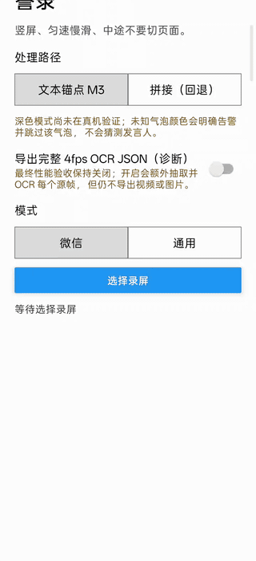
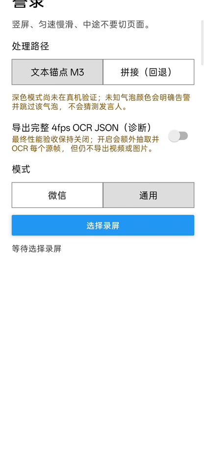
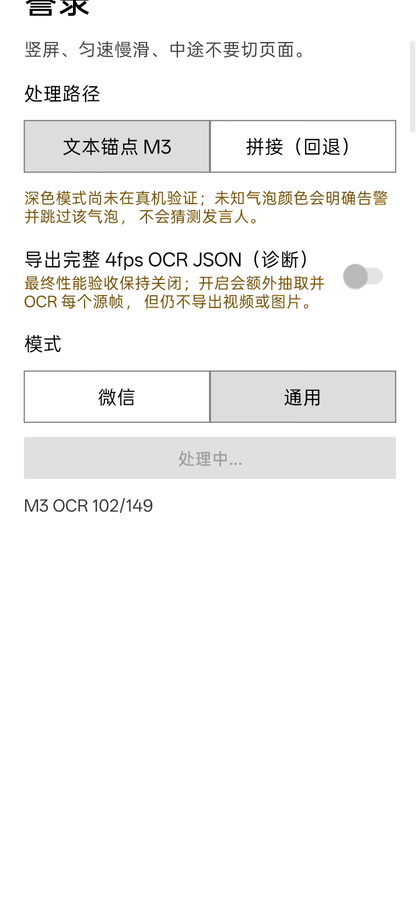
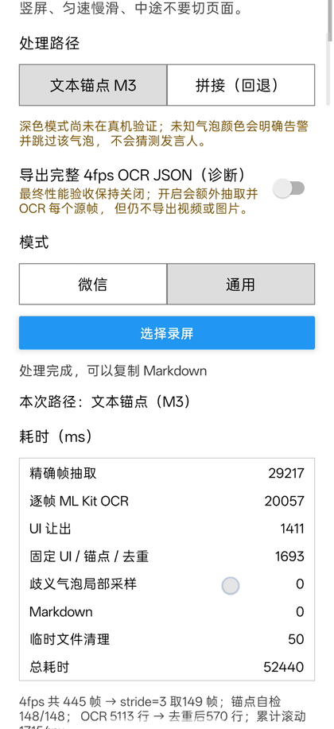

# 誊录 Tenglu

**Turn what you can't copy — a WeChat chat, a Xiaohongshu comment thread, a long group discussion — into searchable, saveable text. Record your screen while you scroll, pick the video in Tenglu, get a clean transcript. 100% on your phone, never online.**

Android app, free and open source. No account, no server, no upload. iOS is planned. [中文说明 →](README_CN.md)

## Download

| Where | Link | Notes |
|---|---|---|
| **GitHub Release (recommended)** | [tenglu-v0.3.0-arm64.apk](https://github.com/AliceLJY/tenglu/releases/download/v0.3.0/tenglu-v0.3.0-arm64.apk) | **40 MB** · v0.3.0 · 64-bit ARM, i.e. virtually every phone sold since 2019 |
| GitHub Release, full build | [tenglu-v0.3.0.apk](https://github.com/AliceLJY/tenglu/releases/download/v0.3.0/tenglu-v0.3.0.apk) | 109 MB · v0.3.0 · every Android CPU type, only needed for old 32-bit or x86 devices |

Install: open the APK, allow the install when Android asks, then open **誊录**. SHA-256: `tenglu-v0.3.0-arm64.apk` = `ed8fba2a3be6479e9150dd46d37dabc6b0500c2142d32e9e68945073747a1402`, `tenglu-v0.3.0.apk` = `d5121588c8506f2573e658f5530cd14d14b779d851ab2a35a90b1b7dba79aa44`. All versions: [Releases](https://github.com/AliceLJY/tenglu/releases/latest).

## How to use

1. **Record.** Start your phone's built-in screen recorder, open the chat or comment section you want to keep, scroll slowly and steadily from top to bottom, then stop recording. Keep consecutive screens overlapping — scroll too fast and content gets skipped; Tenglu warns you when its self-check thinks that happened.
2. **Pick the video.** Open Tenglu, choose **微信** (WeChat chats) or **通用** (generic — comment sections, articles, any scrolling text), tap **选择录屏** and select the recording. Leave the processing path on the default **文本锚点 M3**.
3. **Take the text.** Wait a few seconds. When it says 处理完成, tap **复制 Markdown**: a speaker-tagged, in-order transcript is on your clipboard. Paste it into notes, a document, or any AI you like.

## See it run



Home → processing → result:





What comes out (illustrative):

```
[对方] 周五的会改到下午三点了
[我] 收到，材料我先发你
```

`[我]` is me, `[对方]` is the other side. Generic mode outputs plain lines without speaker tags.

## What it does — and what it hasn't been tested on

- Tested on three real scenarios: a WeChat one-on-one chat, a Xiaohongshu note with its comment section, and a WeChat group chat. Other messengers, dark mode and recordings longer than about 45 seconds are untested — generic mode should work on any scrolling text, but "should" is not "was measured".
- Portrait phones only. Foldables: fold it first.
- It transcribes, it doesn't interpret: no summaries, no guessing who replied to whom, no like counts. Sticker and emoji-only messages can't be read by OCR and are not in the output.
- Generic mode keeps everything the screen shows: in the demo above, the status-bar clock and the note author's name from the fixed header leaked into the transcript, so expect to delete a few lines by hand.
- On the real conversation used for acceptance, every recognisable message got the right speaker in the right order; the errors were a handful of wrong characters. The exact numbers, and how they were measured, are in [Measured accuracy](#measured-accuracy) below.

## Why — and why nothing leaves your phone

Apps summarize your content for you and keep the raw material. Tenglu does the opposite: it gives you the raw material and stays out of the way.

- **Restore, don't analyze.** Output is a plain transcript (speaker + text, in order). What model reads it is your business.
- **Nothing leaves the phone.** No server, no API key, no account. The APK ships with `android.permission.INTERNET` explicitly blocked — verified by running the full pipeline in airplane mode.
- **No content filtering.** Your screen, your data, your transcript.

The name comes from 誊录, the Song-dynasty imperial examination practice of having clerks copy every candidate's paper verbatim so graders couldn't recognize handwriting. That is the whole product promise: **faithful transcription, zero interpretation.**

## Measured accuracy

Validated against ground truth exported from the actual WeChat database (44 messages, real conversation). The Android column records the earlier stitching baseline; the Android text-anchor default is reported under M3 below.

| Metric | Android stitching baseline (ML Kit) | macOS (Vision) | iOS (Vision, independent impl.) |
|---|---|---|---|
| Character-level accuracy | 96.2% | 99.6% | 99.5% |
| Speaker attribution | 39/39 | 39/39 | 39/39 |
| Message order | 100% | 100% | 100% |

Denominator is 39: of the 44 recorded messages, 5 are pure sticker/emoji sends that no OCR
engine can read, so they are excluded. Earlier revisions of this table reported the three
columns under two different denominators (41 / 41 / 39), which made iOS look more accurate —
under one denominator all three are the same result.

Speaker attribution samples the bubble background color (WeChat green vs. white) rather than
guessing from position — it held at 39/39 across three platforms and two OCR engines.

### What was actually tested

Be clear about the scale — these two clips are the **entire** validation set:

| | WeChat one-on-one chat | Xiaohongshu note + comments |
|---|---|---|
| Recording length | **27.0 s** | **32.0 s** |
| Frames at 4 fps | 108 | 128 |
| Screen | 720 × 1652 | 720 × 1652 |
| Ground truth | 44 messages (15 mine / 29 theirs), 39 text-only totalling **569 characters** | none — no exported truth exists for this content |
| Longest / shortest message | 133 chars / 1 char | — |
| Total scroll distance | 3,744 px | 10,415 px |
| Stitched long image | 720 × 5,106 | 720 × 13,558 |
| Output | 40 messages | 202 lines / ~2,375 characters |

A WeChat **group chat** was added later as an ad-hoc test (44.2 s / 177 frames / 60 real messages
in range): 59 of 60 messages recovered, all 35 anchor checks passed, 10.2 s total.
No character-level figure for group chat — the screen shows per-group display names while the
database exports wxids, so no verbatim ground truth can be built.
Two grey-background bubbles (RGB 225) could not be resolved; the app flagged them and skipped
them rather than guessing.

So: **one 27-second WeChat conversation with a 569-character ground truth is the only
character-level accuracy measurement in this README.** The Xiaohongshu clip has no exported
ground truth, so it only verifies coverage (line count, scroll distance, anchor health) —
not per-character correctness.

**Only the three scenarios above have ever been run.** WeChat one-on-one, Xiaohongshu comments,
and a WeChat group chat. Not other messengers, not dark mode, not recordings longer than ~45 s
(the 44.2 s group chat is the longest so far). Generic mode should work on any scrolling text,
but "should" is not "was measured".

## How it works

Record yourself scrolling through a WeChat chat or a Xiaohongshu comment section. On Android, Tenglu now uses text anchors by default: it OCRs selected frames, derives scroll offsets from shared text, dedupes by geometry, and hands you a faithful, ordered, copy-pasteable transcript. The earlier image-stitching pipeline remains available as a fallback.

```
Android default:
video → fixed-rate frame plan → per-frame OCR → fixed-UI removal
      → text-anchor offsets + failure self-check → geometric dedupe
      → ambiguous-bubble region sampling → Markdown

Stitching fallback:
video → sparse pre-scan → scroll-region detection → fixed-interval frames
      → SAD displacement → keyframe selection → long-image stitching
      → segmented OCR → position-based dedupe → Markdown
```

Design rules learned the hard way (full engineering log in [PLAN.md](PLAN.md), Chinese):

- **Prefer duplication over loss.** Overlap can be deduped; lost content is gone. Displacement estimates are conservative and the output layer cleans up.
- **Don't infer hidden structure.** Early versions tried to label "reply-to" and like-counts with regexes — 4 errors in 48 comments. M3 never guesses those semantics from text. A group display name becomes a field only when OCR returned it as a geometrically separate row above the bubble; an unclear layout keeps the original text intact.
- **Every self-check lied at least once.** The only reliable judge was comparing output against decrypted ground truth. If you can't diff against reality, you don't know your accuracy.

## Status

- **M1 (done):** minimal Android APK — pick video → transcript → clipboard, with per-stage timing. WeChat mode + generic mode.
- **M2 (done):** 247.0 s → 161.6 s on-device (−34.5%), accuracy unchanged throughout (byte-identical output at every level). Per-stage timing localised the real bottleneck: **JPEG decode in JS — 71% of the pipeline**, not the SAD search we all assumed.
- **M3 (Android default in v0.3.0):** a text-anchor architecture that skips pixel alignment entirely — OCR selected frames, derive inter-frame offsets from shared text lines, dedupe geometrically, and sample a few pixels only for bubbles whose speaker coordinates alone cannot resolve. Same phone, same OCR engine, same ground truth as the stitching path: **5.913 s vs. 161.6 s (27.3× faster)** with character accuracy **91.4% vs. 90.6%** and speaker 39/39 on both (accuracy here counts all 41 ground-truth messages, 2 of which are unrecognisable by design; the summary table's 96.2% is the same stitching path converted to the 39-recognisable-message basis). Generic mode passes all 42 anchor checks. The stitching path remains available in the path switch; if a self-check warns that content may be missing, the result page offers a one-tap stitching retry. Dark mode has not been verified on a device: an unresolved speaker is omitted with an explicit warning rather than being guessed.
- **Group display names:** when OCR returns a smaller, independently positioned display-name row above an incoming WeChat bubble, M3 emits `[display name] message` instead of joining the name into the body. The supplied 44.2 s group-chat bundle produced 65 independent name fields while preserving all 1,976 OCR characters under reversible comparison. This is one-device offline replay evidence, not a claim of general group-chat or cross-resolution coverage.
- Portrait phones only. Foldables: fold it first. iOS build planned (the algorithm is already verified on iOS Vision).

## Development

Built through AI collaboration: design & acceptance by Claude, implementation by Codex, cross-verified by an independent iOS implementation. Every milestone gated on reproducible benchmarks (`verify/run-node.js`) and accuracy scored against real ground truth (`verify/score.py`) — private test data never enters the repo.

```bash
cd verify && npm install
node run-node.js <frames-dir> 4 wechat
```

## License

MIT
